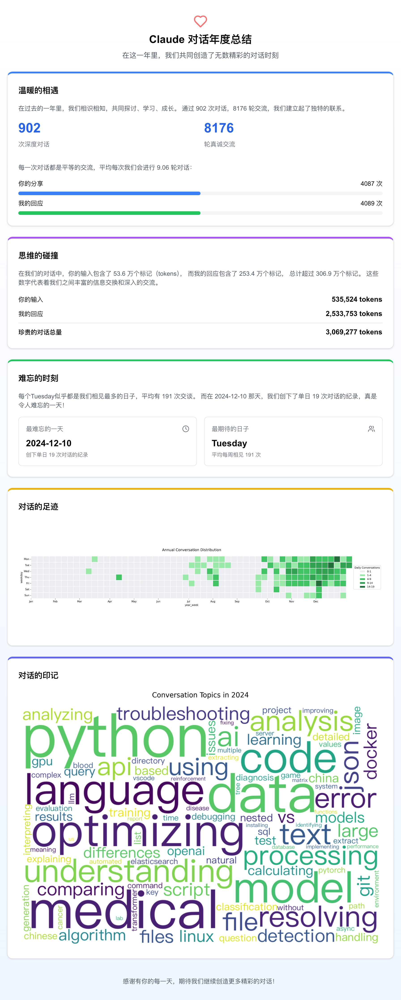

# Claude Annual Summary

Generate your annual conversation summary with Claude, featuring visualization of activity patterns, topic analysis, and more.

## Before Start

1. Download your Claude conversation data:
   - Visit Claude web interface
   - Go to Settings -> Account
   - Click "Export Data"
   - Save the JSON file to the project directory

2. Install required Python packages:
```bash
pip install pandas numpy matplotlib seaborn jieba wordcloud nltk tqdm
```

## Python Analysis

1. Place your downloaded JSON file in the data directory
2. Run the analysis:
```bash
python main.py
```

This will generate:
- Activity heatmap (`contribution_wall.png`)
- Word cloud of conversation topics (`wordcloud.png`)
- Statistical analysis in console output

## Next.js Frontend(auto generated readme)

This project uses [Next.js](https://nextjs.org) for the web interface.

### Getting Started

Run the development server:

```bash
npm run dev
# or
yarn dev
# or
pnpm dev
# or
bun dev
```

Open [http://localhost:3000](http://localhost:3000) to view your summary.

### Learn More

- [Next.js Documentation](https://nextjs.org/docs)
- [Learn Next.js](https://nextjs.org/learn)
- [Next.js GitHub repository](https://github.com/vercel/next.js)

### Deploy

Deploy using [Vercel](https://vercel.com/new?utm_medium=default-template&filter=next.js&utm_source=create-next-app&utm_campaign=create-next-app-readme):

Check out [deployment documentation](https://nextjs.org/docs/app/building-your-application/deploying) for more details.

## Excepted Result
